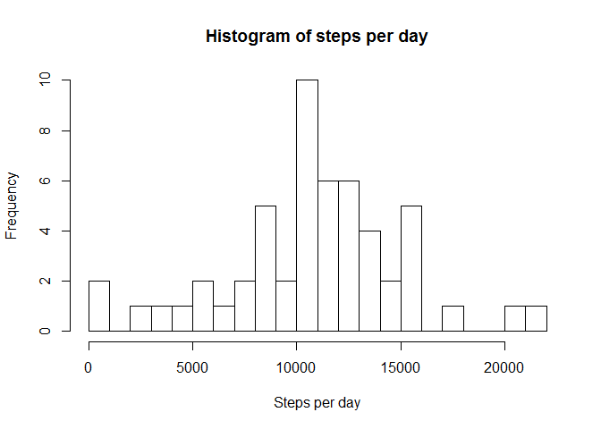
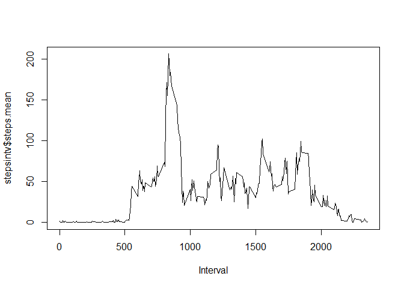
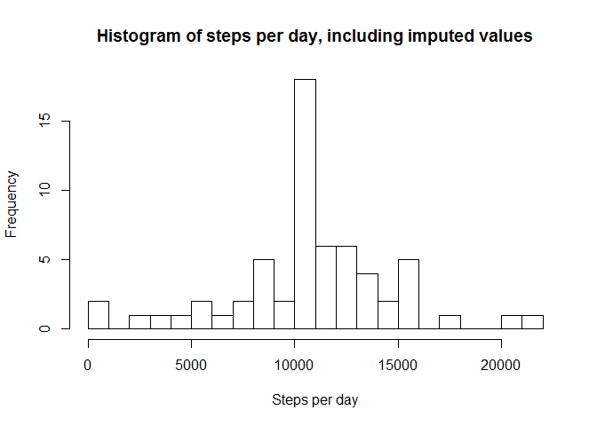
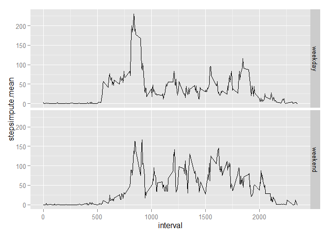

Analysing steps data
========
First read the data in from the local folder where it's stored, and convert date from character to POSIXlt format.  

```r
activity <- read.csv("H:/r_coursera_files/data/activity.csv", stringsAsFactors=FALSE)
activity$date<-strptime(activity$date,format="%Y-%m-%d")
```
##Activity across days
Then summarize the data: generate a table of total steps per day. For convenience, first define a new data frame without the NA values  

```r
activityv<-activity[which(!is.na(activity$steps)), ]
library("doBy", lib.loc="~/R/win-library/3.1")
```

```
## Loading required package: survival
## Loading required package: splines
```

```r
stepsperdayv<-summaryBy(steps~date,FUN=sum,data=activityv)
```
Make a histogram of the daily steps    

```r
hist(stepsperdayv$steps.sum,breaks=20,xlab="Steps per day",main="Histogram of steps per day")
```

 
  
Calculate mean and median daily steps  

```r
median(stepsperdayv$steps.sum)
```

```
## [1] 10765
```

```r
mean(stepsperdayv$steps.sum)
```

```
## [1] 10766.19
```
##Activity within a typical day
Summarize data: average steps across days within each time interval interval.  

```r
stepsintv<-summaryBy(steps~interval,FUN=mean,data=activityv)
```
Plot (type="l") average steps against interval  

```r
plot(stepsintv$interval, stepsintv$steps.mean,type="l",xlab="Interval")
```

 
  
Identify interval with the largest average step count: this command returns the interval number only  

```r
stepsintv[which(stepsintv$steps.mean==max(stepsintv$steps.mean)),1]
```

```
## [1] 835
```
##Dealing with missing values
Count total number of rows with NAs (using summary can tell that it's only the steps variable that has NA values)  

```r
sum(is.na(activity$steps))
```

```
## [1] 2304
```
  
Fill in missing values: my choice is to go by mean for interval: create new dataset that has original values with NA steps replaced by mean(int): one way to do this is to merge in the summarized value corresponding to the interval, and then create a new variable and populate it based on whether the steps variable is missing or not. 

```r
activityi<-merge(activity,stepsintv)
#if na, then return steps.mean; else return steps
activityi$stepsimpute<-ifelse(is.na(activityi$steps), activityi$steps.mean, activityi$steps)
```
Now make new histogram of steps/day and compare to previous version; also calculate new mean and median values of steps per day and compare to previous. Different? "What is the impact of imputing missing data on the estimates of the total daily number of steps?"--the former mean was 1 step smaller than the median, whereas the new mean and median are identical to the old median.  

```r
stepsperdayi<-summaryBy(stepsimpute~date,FUN=sum,data=activityi)
hist(stepsperdayi$stepsimpute,breaks=20,xlab="Steps per day",main="Histogram of steps per day, including imputed values")
```

 

```r
median(stepsperdayi$stepsimpute)
```

```
## [1] 10766.19
```

```r
mean(stepsperdayi$stepsimpute)
```

```
## [1] 10766.19
```
#Differences between weekdays and weekends
Starting from dataset with imputed values, create new factor variable with levels weekday and weekend  

```r
#this returns a weekday as a decimal number: monday = 1 sunday = 7
activityi$wd<-as.numeric(format(activityi$date, "%u"))
activityi$we<-as.factor(ifelse(activityi$wd %in% c(6,7),"weekend", "weekday"))
```
Make a panel line plot of average steps against interval for weekdays and weekends  

```r
#first make summary
stepsinti<-summaryBy(stepsimpute~interval+we,FUN=mean,data=activityi)
#then use ggplot
library("ggplot2", lib.loc="~/R/win-library/3.1")
ggplot(stepsinti,aes(x=interval,y=stepsimpute.mean))+geom_line()+ facet_grid(we ~ .)
```

 
  
The subject sleeps in on weekends, and is more active during the day on weekends than on weekdays!
